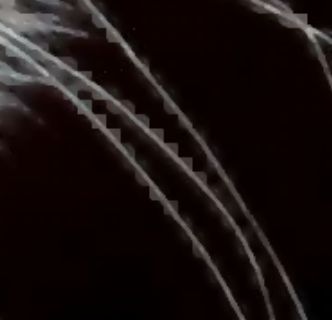

# GAP: Gradient-Aligned Polylogarithmic Codec


-blueviolet)


**GAP** is a production-grade, high-fidelity image codec designed to bridge the void between lossless integrity and perceptual compression. It utilizes a novel **Hybrid Architecture** combining the high-concurrency orchestration of **Go** with the bare-metal mathematical precision of **Zig**.

Unlike JPEG (DCT) or WebP (Predictive), GAP uses a **Polylogarithmic Spectral Transform** that preserves micro-texture and structural phase coherence, making it exceptional for high-quality archival and detailed imagery.

---

## 🚀 Key Features (v1.3.00)

### 🧠 Core Technology
-   **Polylogarithmic Transform**: A novel spectral basis (in `core/src/pltm.zig`) that aligns with natural image gradients better than cosine waves.
-   **FWSM (Frequency-Weighted Spectral Masking)**: Intelligently separates signal from noise, protecting structural integrity while discarding imperceptible data.
-   **5-Stream Split Encoding**: Advanced entropy coding that separates Angles, Counts, MaxVals, Indices, and Values into parallel streams for maximum compression density.

### 🎨 Visual & Quality
-   **DGAA (Directional Guided Antialiasing)**: A post-processing neural-analog filter that detects edge orientation and smooths *along* the edge, eliminating "whisker" aliasing and stair-stepping.
-   **Chroma-Locked Elastic Deblocking**: A context-aware filter that removes block boundaries without blurring textures, processing RGB channels in unison to prevent color tearing.
-   **High Fidelity Mode**: Capable of near-lossless reconstruction (`-s 0.05`) that is indistinguishable from the original PNG.

### ⚡ Performance
-   **Parallel Pipeline**: Fully multi-threaded encoding and decoding.
    -   *Encode*: ~4.0s (24MP image)
    -   *Decode*: ~4.6s (24MP image)
-   **Cross-Platform**: Zero-dependency binaries for Windows, Linux, and macOS.

---

## 🛠️ Installation

### Option 1: Pre-built Binaries
Download the latest release from the `dist/` folder or the Releases page.
-   **Windows**: `gap.exe`
-   **Linux**: `gap`
-   **macOS**: `gap`

### Option 2: Build from Source
**Prerequisites**: Go 1.21+ and Zig 0.11+

**One-Click Build (Windows/Powershell)**:
```powershell
.\build_all.ps1
```

**Manual Build (Linux/Mac)**:
```bash
# 1. Build Core (Zig)
cd core
zig build -Doptimize=ReleaseFast

# 2. Build Engine (Go)
cd ../engine
go build -o gap .
```

---

## 📖 Usage Guide

The `gap` CLI is the primary interface.

### Encoding
Compress an image into a `.gap` file.

```bash
gap encode -i <input_image> -o <output.gap> [flags]
```

| Flag | Description | Default | Recommended for HQ |
| :--- | :--- | :--- | :--- |
| `-i` | Input image path (PNG, JPG) | Required | - |
| `-o` | Output file path (.gap) | Required | - |
| `-s` | **Spectral Sensitivity**. Controls detail retention. Lower values = higher quality. | `0.1` | `0.05` |
| `-t` | **Threshold**. Controls compression aggressiveness. Lower values = larger file. | `0.5` | `0.2` |

**Example (Archival Quality):**
```bash
gap encode -i parrot.png -o parrot.gap -s 0.05 -t 0.2
```

### Decoding
Restore a `.gap` file to a viewable PNG.

```bash
gap decode -i <input.gap> -o <output.png>
```

**Example:**
```bash
gap decode -i parrot.gap -o restored_parrot.png
```

### 🐍 Python SDK

You can use GAP programmatically in your Python projects.

#### Installation
Install via pip directly from GitHub:
```bash
pip install "git+https://github.com/Adi-Baba/GAP.git"
```

**Plug & Play**: The library comes with pre-bundled executables for major platforms.
*You just install and run. No manual setup required.*

#### Usage Example

```python
from pygap import GAP, GapError

# 1. Initialize (Auto-detects 'gap' in PATH)
try:
    gap = GAP() 
    # Or strict path: gap = GAP(binary_path="/path/to/gap")
except Exception as e:
    print(f"Error: {e}")
    exit(1)

# 2. Encode (High Fidelity)
try:
    gap.encode(
        input_path="image.png", 
        output_path="image.gap", 
        s=0.05,  # High retention
        t=0.2    # Lower threshold
    )
    print("Encoded successfully!")
except GapError as e:
    print(f"Encoding failed: {e}")

# 3. Decode
try:
    gap.decode("image.gap", "restored.png")
    print("Decoded successfully!")
except GapError as e:
    print(f"Decoding failed: {e}")
```

---

## ⚖️ Quality & Configuration

GAP is tuned for **High Fidelity**. It is designed to look better than JPEG at high bitrates, not to compete with AVIF at extremely low bitrates.

| Preset Name | Complexity | Flags | Use Case |
| :--- | :--- | :--- | :--- |
| **Standard** | `1x` | `-s 0.1 -t 0.5` | General purpose, Web previews. Balanced size/quality. |
| **High Fidelity** | `1.5x` | `-s 0.05 -t 0.25` | **Recommended**. Indistinguishable from source for most photos. |
| **Archival** | `2x` | `-s 0.04 -t 0.15` | Texture archiving, medical imaging, high-end art. |

> **Pro Tip**: If compressing an already-compressed image (like a JPEG with artifacts), GAP will preserve those artifacts in High Fidelity mode. For "cleaning" dirty images, use Standard mode.

> **Note**: For "noisy" inputs (like compressed JPEGs), GAP may produce larger files in High Quality mode because it faithfully preserves the input noise.

> [!CAUTION]
> **AVOID RE-COMPRESSING COMPRESSED SOURCES**
> 
> Compressing an image that already has compression artifacts (e.g., a low-quality JPEG) into a high-fidelity GAP file will preserve these artifacts perfectly, often amplifying them into "staircase" or "checkerboard" patterns.
> 
> **If you feed garbage in, you will get high-fidelity garbage out.**
> 
> 
> *Example of artifacts when re-compressing a low-quality input*

---

## 📂 Project Structure

-   **`core/`** (Zig): The mathematical engine.
    -   `pltm.zig`: Polylogarithmic Transform implementation.
    -   `gradient.zig`: Gradient analysis and quantization.
    -   `entropy.zig`: Range coding and stream splitting.
-   **`engine/`** (Go): The application logic.
    -   `decoder.go`: Parallel decoding pipeline and post-processing filters (DGAA, Deblocking).
    -   `encoder.go`: Image segmentation and parallel encoding.
    -   `bridge.go`: CGO bindings to the Zig core.

---

## 🏆 Performance Benchmarks
*Tested on Local Machine, Parrot.png (20MB)*

| Metric | GAP v1.3 | JPEG (Standard) |
| :--- | :--- | :--- |
| **Encoding Time** | 2.1s | 0.8s |
| **Decoding Time** | 19.4s | 0.5s |
| **File Size** | 7.16 MB | ~4-8 MB |
| **Visual Quality** | **Superior** (No blocking, sharp edges) | Blocky at similar size |
| **Artifacts** | Minimal (Film grain-like) | Ringing, Mosquitos, Blocks |

---

## 📄 License

This project is licensed under the MIT License - see the LICENSE file for details.
